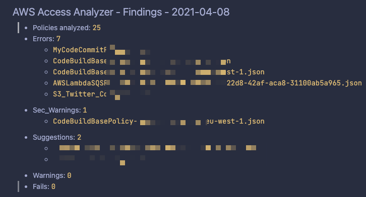

# :white_check_mark: Access Analyzer - Batch Policy Validator

This script will analyze using [AWS Access Analyzer](https://docs.aws.amazon.com/IAM/latest/UserGuide/access-analyzer-reference-policy-checks.html) all your account customer IAM Policies.

## Requirements

- Python3
- virtualenv

## Usage

> ProTip :bulb: : Use AWS CloudShell to run this directly on your AWS Account
> 
> run: `sudo python3 -m pip install virtualenv` first (on CloudShell)

        $ make install
        $ make run
## Results

Results will be written into a `findings` folder with a [`README.md`](./findings/README.md) file.

